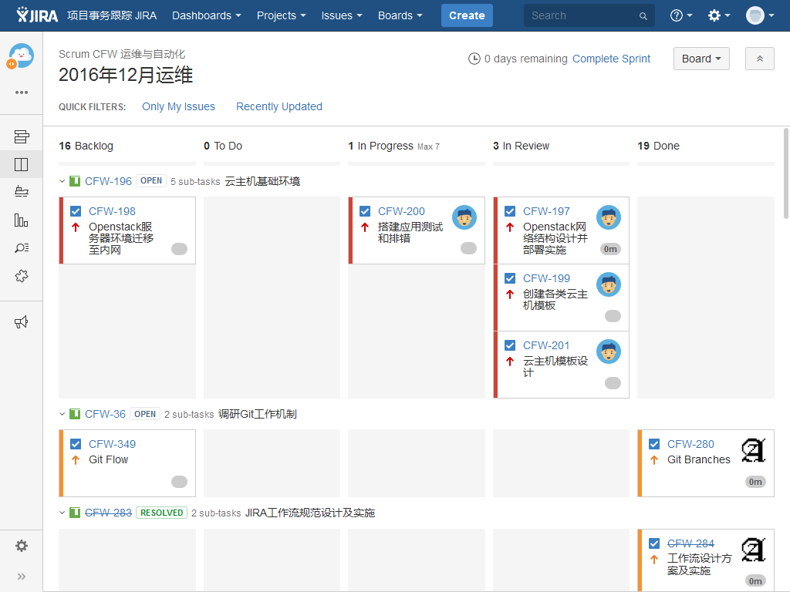
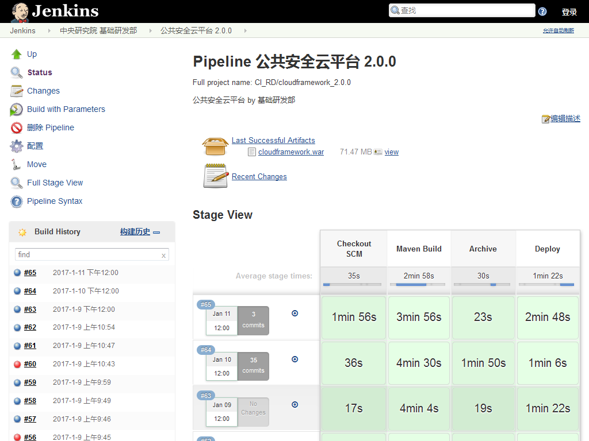
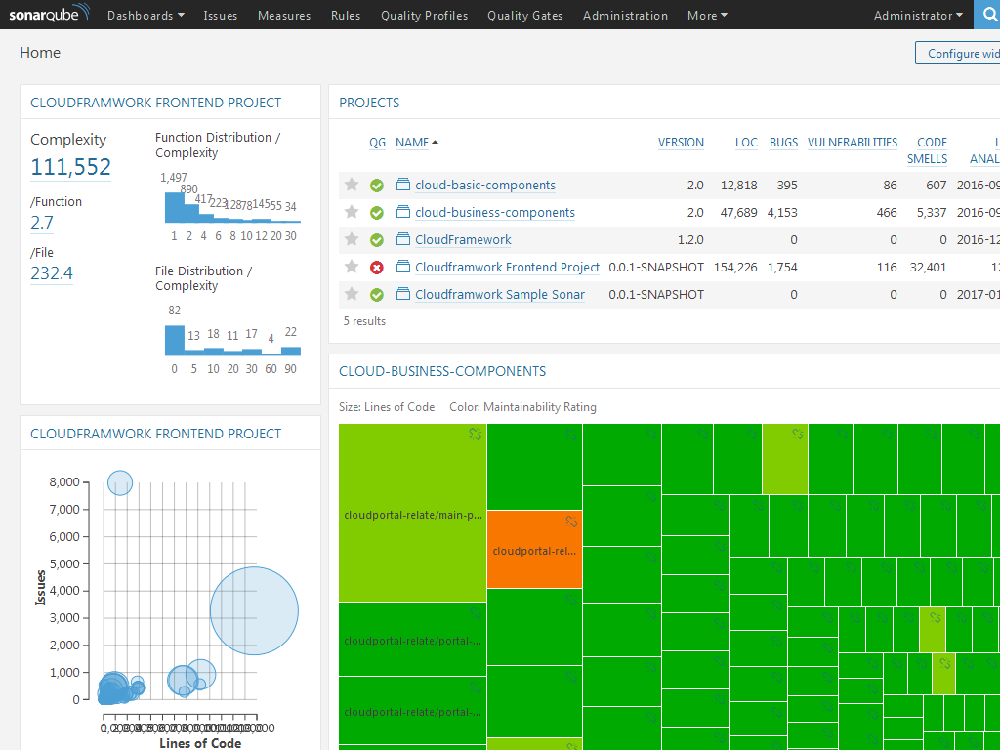
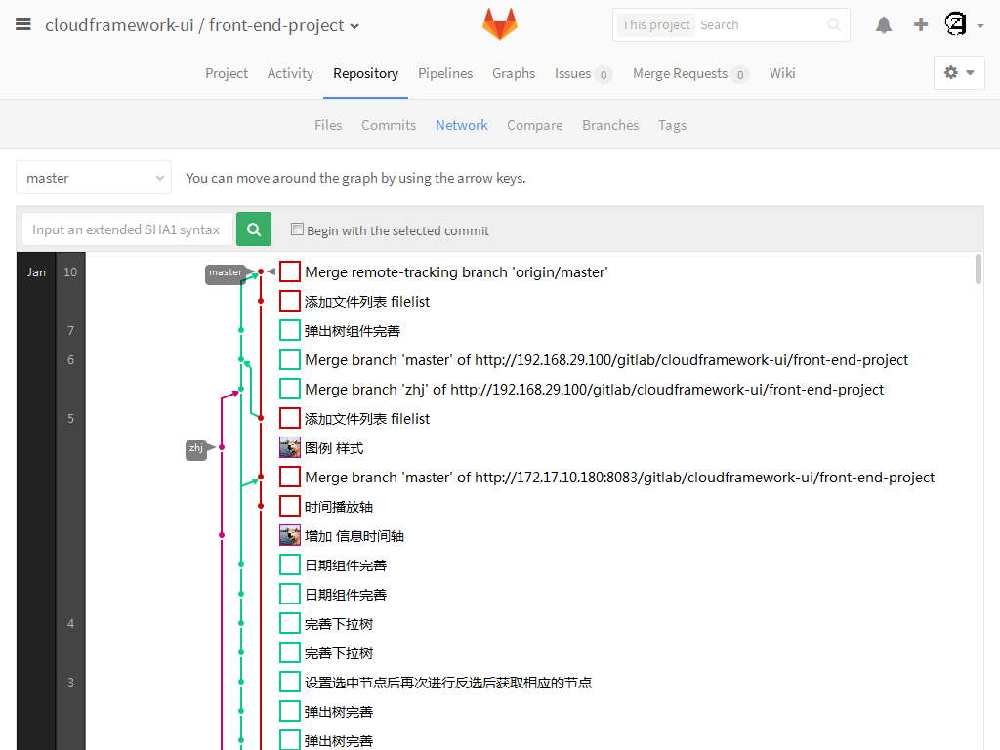

# DevOps实施指导方案
## 工作方式改进
### 代码质量
#### 代码检查
代码检查需要基于代码规范进行

- [ ] 建立代码实施规范

  代码规范可以提高代码复用性，降低故障排查及二次开发的成本
  > 开发者根据开发习惯制定嗲吗编写规范

- [ ] 制定代码检查规范

  代码检查可以在更早发现由于代码不规范造成的潜在问题，静态代码检查是白盒测试的一部分
  > 开发者根据开发习惯在 ```Sonar``` 原有代码检查规则基础上进行修改

- [ ] 本地代码扫描

  本地代码扫描通过集成在IDE中的 ```SonarLint``` 插件实现，配置与 ```SonarQube``` 服务器的链接后即可同步代码扫描配置
  > 开发者在提交代码时应保证代码能通过扫描

- [ ] 远程代码扫描

  > 持续集成任务会在远程发起后台代码扫描任务
  >
  > 服务器位于 [SonarQube](http://172.17.10.180/sonar)

#### 单元测试
通过测试是代码发布的底线
- [ ] 单元测试覆盖

  > 开发者提交代码时，应编写单元测试用例并尽可能覆盖全部功能点

- [ ] 单元测试通过

  > 开发者提交代码时，应保证单元测试能够通过

#### 自动化测试
- [ ] 编写测试用例

  传统开发流程中，测试往往在项目即将交付时才加入，测试用例经常只是记录测试过程的日志；自动化测试用例的编写并不需要等待功能开发完毕，在需求确定后，根据需求期望实现的目标即可着手自动化测试用例的编写；在部分场合，自动化测试用例甚至可以用来指导功能的开发
  > 测试人员在编写自动化测试用例时，应根据需求尽量覆盖所有需要测试的功能点

- [ ] 自动化测试任务计划执行

  只进行一次的自动化测试，成本远高于手动测试；自动化测试脚本编写之后应根据测试计划反复进行测试，发现新引入的问题同时验证旧的问题是否被修复
  > 持续集成任务会根据需要发起相应的自动化测试任务

### 敏捷开发实践
- [x] [敏捷事务](http://172.17.10.180/confluence/pages/viewpage.action?pageId=3179646)
  > 依照参考文档使用敏捷事务管理任务

- [x] [敏捷看板](http://172.17.10.180/confluence/pages/viewpage.action?pageId=3179650)
  > 依照参考文档使用敏捷看板查看事务

### 分支工作流
参考Git Flow进行多分支管理[Gitlab分支](http://172.17.10.180/confluence/pages/viewpage.action?pageId=4030524)
- [ ] ```Master``` 主分支随时处于可发布状态
  > 代码主干分支，仅使用Tag标记进行提交发布版本代码

- [ ] ```Develop``` 在开发分支上进行集成测试，尽早发现尽早修复
  > 代码开发分支，用于进行代码整合与集成测试

- [ ] ```Feature``` 各功能分支上的开发互不干扰
  > 代码功能开发分支，用于进行各功能模块的开发，开发完毕后提交 ```Merge Request``` 进行整合

- [ ] ```Review``` 功能集成时通过评审降低引入新问题的可能性
  > ```Merge Request``` 在通过前应进行评审
  > 
  > [代码提交规范](commit.md)

### 自动化构建
- [ ] 构建脚本化
  构建脚本的主干应尽可能通用，每次构建时通过参数控制构建
  > 为了满足复杂的功能需求，应尽量使用脚本进行构建，```Jenkins``` 的构建 ```Pipeline``` 使用 ```Groovy```作为校本
  >
  > 复杂的脚本可以用其他语言进行开发，并在```Pipeline```中调用
  > - [Maven项目规范](../maven/project.md)
  > - [Maven本地配置](../maven/settings.md)
  > - [Maven项目配置](../maven/pom.md)
  > - [语义化版本](version.md)

- [ ] 构建配置化
  所有项目中的配置项都应该被整合抽出，不同环境使用独立的profile维护
  > 配置文件可以交由构建脚本维护

- [ ] 构建计划
  构建计划根据构建类型的不同有不同的计划标准，同时根据构建目标选用相应的profile。如：快照构建应基于每次代码变更进行，随时保持开发者能取到最新的功能代码；发布构建应基于发布计划进行，同时在构建时采集变更日志，以便交付时一并输出
  > 快照构建会每隔6对代码仓库进行扫描，在代码有变更的时候进行快照构建，并将通过构建的代码发布至 ```Nexus``` ```Snapshot``` ```Repository``` 以供开发使用
  >
  > 发布构建会根据版本发布计划收集开发周期中的变更日志，并多次进行测试直到通过，最终修改版本号并发布至 ```Nexus``` ```Snapshot``` ```Repository``` 以供交付使用

---

## 持续集成服务
### 工具与集成
#### 持续集成工具
- [x] ```Jenkins``` 管线服务

  将持续集成工序串联起来的pipeline，用于计划执行任务，并接收反馈
  > 每个项目由一名开发运维工程师对 ```Pipeline``` 对项目脚本进行维护即可

- [x] ```Sonar``` 代码扫描

  提供代码扫描并收集展示结果
  > 用户基本只看返回的结果即可

- [x] ```Git/SVN``` 代码托管

  提供代码托管及版本控制，代码开发的分支管理，及合并评审流程
  > 分支的创建与分支的合并应由有经验的开发者进行
  >
  > 分支合并的评审可以使用Gitlab的线上评论功能或者线下进行

- [x] ```JIRA``` 敏捷事务

  用于管理敏捷事务，将不同的用户根据其职能与事务进行联接

- [x] ```OpenLDAP``` 统一账号管理

  提供统一账号的管理与认证服务

- [x] ```Nexus``` 代码仓库

  有别于 ```Git/SVN``` ， ```Nexus``` 管理的是打包发布后的代码
  > 各部门维护各部门 ```Nexus``` 仓库
  >
  > 质量管理部门维护发布仓库
  >
  >[仓库配置](repository.md)

- [ ] ```HipChat``` 团队即时通信工具

  待定

#### 工具之间集成
多种持续集成工具主要通过各自的WebHook进行交互
- [ ] ```IDE``` 调用 ```Sonar``` 插件进行本地代码扫描
- [x] ```Jenkins``` 扫描 ```Git/SVN``` 的代码提交从而触发构建任务
- [x] ```Jenkins``` 在构建工程中调用 ```Sonar``` 进行代码扫描并收集结果
- [ ] ```Jenkins``` 将构建成果物发布至 ```Nexus``` 以便开发者之间分享
- [ ] ```Jenkins``` 将构架结果发布给 ```JIRA``` 的关联事务
- [ ] ```Git/SVN``` 通知 ```JIRA``` 相关事务的代码已经被开发完成

### 看板与报告
- ```JIRA``` 提供的敏捷看板可以查看事务状态
  

- ```Jenkins``` 提供的任务看板可以查看任务状态
  

- ```Soanr``` 提供的看板可以查看代码扫描状态及质量信息
  

- ```Git``` 提供的代码看板与分支看板可以查看代码与分支的状态
  

### 服务化实现
- [ ] 尽量用钩子或者计划任务检测环境变化主动执行任务，减少用户手动发起任务的场景
- [ ] 尽量把复杂的脚本或操作封装成简单的接口，用户只修改关键的启动参数即可通过少数脚本/任务实现复杂多样的功能，同时环境相关的参数也应该通过配置变更
